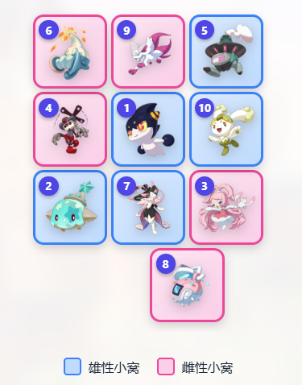

# 更新日志

这里记录工具站的主要更新。  
尽量用玩家能看懂的方式说明：新增了什么、优化了什么、修好了什么。

[返回首页说明](./README.md)

---

## 截图待补充

> **【图片待补充：新版主页】**  
> 可以放一张新版主页截图，展示远行商人提醒和工具入口。  
> 建议图片位置：`./screenshots/v2-home.png`

> **【图片待补充：奇遇混抓推荐】**  
> 可以放一张推荐结果截图，展示目标选择、排序按钮和推荐卡片。  
> 建议图片位置：`./screenshots/v2-adventure.png`

> **【图片待补充：精灵图鉴详情】**  
> 可以放一张精灵详情截图，展示果实收益和进化链。  
> 建议图片位置：`./screenshots/v2-handbook.png`

---

## [v2.0.0] - 2026-06-02

> 这次是一次大更新：网站从单独的家园小窝排布工具，升级成了包含多个常用功能的工具站。

### 新增内容

- 新增网站主页，可以从主页直接进入各个工具。
- 新增远行商人提醒，主页会展示当前售卖商品和价格。
- 新增精灵图鉴模块，可以查看精灵资料、果实收益和进化链。
- 新增奇遇混抓推荐模块，帮助玩家筛选更合适的混抓组合。
- 新增推荐规则说明，在奇遇混抓页面可以直接查看。
- 新增反馈入口，遇到问题或有建议时可以更方便地联系我。
- 各功能页面新增“回到顶部”按钮，长页面浏览更轻松。

### 体验优化

- 主页布局重新整理，功能入口更清晰。
- 远行商人区域视觉效果优化，商品、价格和商人形象更容易辨认。
- 手机端适配进一步优化，减少图片或内容超出屏幕的问题。
- 精灵图鉴详情页重新排版，果实收益和进化链可以同时查看。
- 从精灵详情返回列表时，会尽量保留原来的浏览位置。
- 奇遇混抓推荐的搜索区更直观，可以选择目标，也可以限制参与混抓的精灵。
- 排序方式改成两个直接可点的按钮：
  - **星光值优先**
  - **少歪异色优先**
- 推荐规则说明重新整理，读起来更像给玩家看的说明，而不是复杂文档。

### 推荐规则调整

- 奇遇目标和混抓对象现在会尽量按“家族”展示，减少同一进化链重复出现带来的干扰。
- 推荐时会综合考虑精灵家族的星光值表现。
- “还可能触发”的目标范围经过重新整理，推荐结果更贴近奇遇混抓的实际使用场景。
- 如果同一个编号存在多个外观或形态，计算时会尽量避免重复干扰结果。

### 问题修复

- 修复远行商人偶尔显示异常的问题。
- 修复手机端远行商人图片位置不合适的问题。
- 修复奇遇混抓中输入限定精灵后可能找不到推荐结果的问题。
- 修复奇遇目标名称显示多余符号的问题。
- 修复精灵图鉴从详情页返回后自动跳到顶部的问题。
- 调整反馈方式，不再让用户填写后等待网页保存，而是直接通过邮箱发送。

---

## [v1.2.1] - 2026-05-29

> 异色精灵展示优化。

### 优化

- 异色精灵开始使用独立图标，和普通精灵区分更明显。

---

## [v1.2.0] - 2026-05-28

> S2 赛季内容更新。

### 新增

- 补充 S2 赛季新增精灵资料。
- 为后续奇遇相关功能准备了更多资料。

---

## [v1.1.1] - 2026-05-09

> 移动端显示修复。

### 修复

- 修复手机端部分区域显示过宽的问题。

---

## [v1.1.0] - 2026-05-08

> 家园小窝排布体验升级。

### 新增

- 排布结果加入精灵头像。
- 排布结果加入性别标识。
- 小窝摆放效果更直观，方便照着结果在游戏中布置。

### 优化

- 页面视觉效果升级。
- 电脑端和手机端显示效果优化。
- 排布结果展示更清晰。

### 修复

- 修复二次生成时结果可能没有及时更新的问题。
- 修复少数小窝数量下页面可能异常的问题。

---

## [v1.0.0] - 2026-05-07

> 家园小窝排布工具首次发布。

### 新增

- 支持选择小窝数量。
- 支持输入精灵并自动识别相关信息。
- 支持按精灵性别和蛋组判断可配对关系。
- 支持生成排布结果。
- 支持查看配对明细。

---

后续会继续根据游戏更新和玩家反馈慢慢完善。

