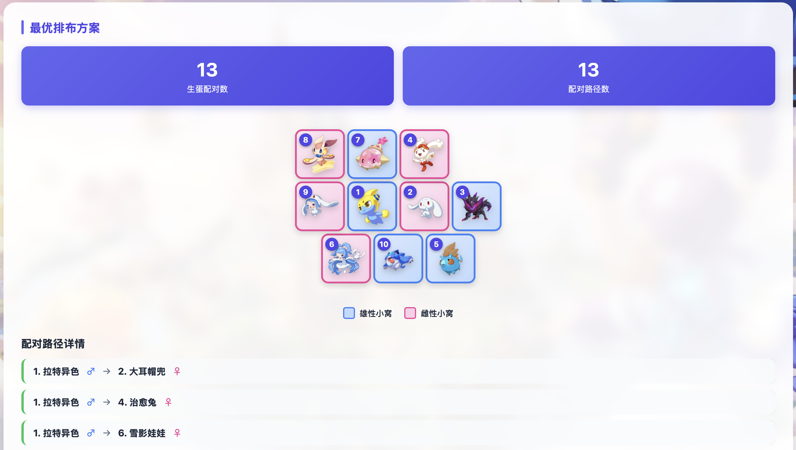

# 洛克王国家园孵蛋最优排布计算系统

✨ **一键计算最优阵型，榨干家园每一寸空间，孵蛋狂魔的终极摸鱼神器！** ✨

[**👉 点击这里直接体验网页版 👈**](http://wentao-home.cn)

---

## 🌟 为什么你需要这个工具？

在家园系统中，想要让多对精灵同时生蛋，小窝的摆放位置至关重要。瞎摆一通？可能会导致大量精灵互相“够不着”，白白浪费孵蛋时间。

本系统专为**极限压榨孵蛋效率**而生！你只需要告诉系统你有哪些精灵，剩下的排兵布阵，交给我们的大脑。

### 🚀 核心亮点

* **🧠 极限配对，告别低效**：无论你是 2 个小窝还是 10 个小窝，系统都能瞬间为你算出交叉重叠的最优阵型，让生蛋路径最大化！
* **🔍 智能联想，丝滑输入**：内置最新游戏图鉴数据，只需输入精灵名字的几个字，即可自动补全并识别对应的【蛋组】，小白也能闭眼用。
* **🖼️ 纯享版图示，一目了然**：拒绝枯燥的坐标数字！计算结果直接展示**精灵高清头像**与**红蓝性别角标**，连连看一样简单，照着抄作业就完事了。
* **📱 手机电脑，完美适配**：精心打磨的响应式 UI，无论你是用电脑多开，还是躺在床上用手机查攻略，都能获得极其舒适的视觉体验。

---

## 📸 界面预览

---

## 🕹️ 傻瓜式使用教程

只需要简单的 3 步，即可获得你的专属家园阵型：

1.  **选择规模**：在下拉菜单中选择你当前家园要放的【小窝总数】（支持 2~10 窝）。
2.  **输入精灵**：依次输入你要孵蛋的精灵名称。输入时会有自动提示，选中后**别忘了点击切换对应的性别（♂雄性 / ♀雌性）**。
3.  **见证奇迹**：点击 `✨ 生成最优排布` 按钮！
    * 页面下方会立刻为你画出“抄作业”图纸。
    * 右侧还会详细列出“谁和谁配对成功”的清单，绝不遗漏任何一对可能！

---

## 📝 常见问题

**Q：为什么有的精灵算出来配对数为 0？**
A：洛克王国的生蛋规则十分严格：① 必须是异性；② 两人必须包含至少一个相同的“蛋组”。如果不满足这两个条件，哪怕住得再近也无法生蛋哦！系统会在你输入时自动校验这些规则。

**Q：生成的网格图看着有点错落不齐，是正常的吗？**
A：**绝对正常，而且这正是本工具的精髓！** 游戏里的小窝是 2x2 的大小，系统特意采用了“错位排布法”，利用网格缝隙让小窝之间的接触面积达到物理极限，从而突破常规摆法的配对上限。

---

## 🤝 致谢与开源说明

* **数据鸣谢**：本网站部分底层蛋组数据来源于强大的 [洛克王国世界 WIKI](https://wiki.biligame.com/rocom)，感谢 WIKI 组大佬们的无私奉献！
* **开源协议**：本项目基于 **MIT License** 免费开源。
    * 欢迎广大玩家白嫖使用！
    * 也极度欢迎各位懂技术的各位大佬基于本项目（`fork`）做出更好玩、更牛逼的洛克衍生工具！

  
  **如果这个小工具帮到了你，不妨在右上角点一个 ⭐️ Star 吧！这对我非常重要！**
  
  [提出问题或建议 (Issues)](https://github.com/TartyKisser/ROCOM_hatch_eggs/issues)
  

