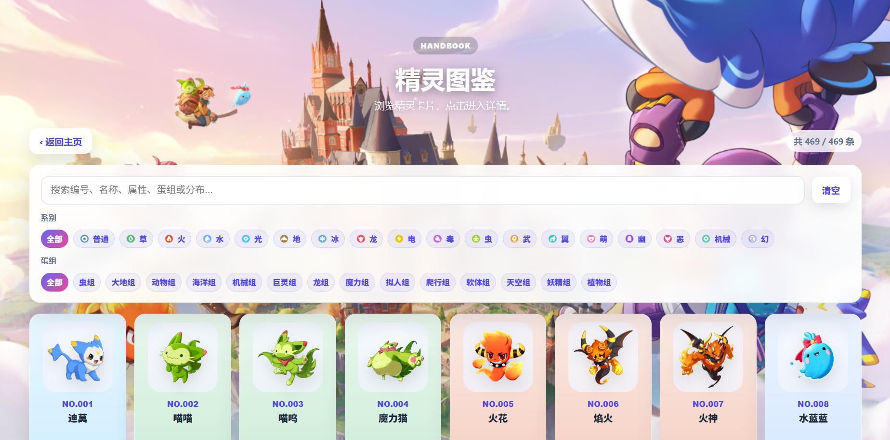
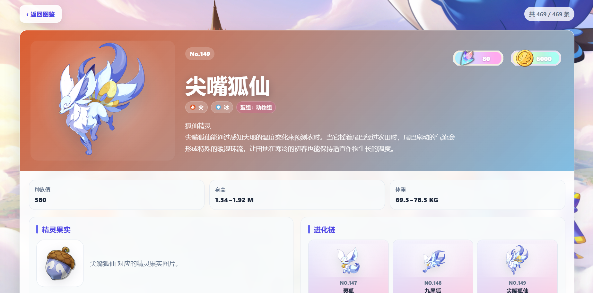
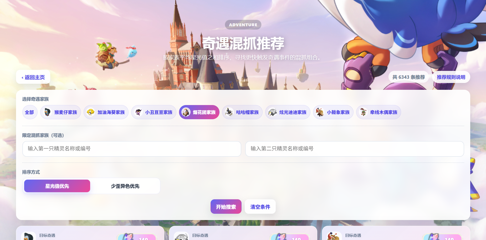
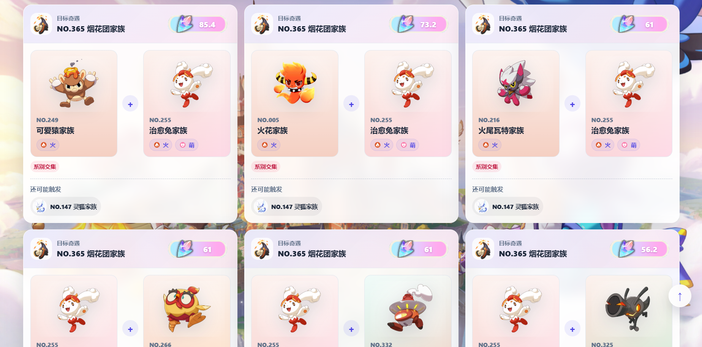

# 洛克王国世界工具站

✨ **查图鉴、算排布、看商人、找混抓方案，洛克玩家的一站式顺手小工具！** ✨

[**👉 点击这里直接体验网页版 👈**](http://wentao-home.cn)

---

## 🌟 为什么你需要这个工具站？

在洛克王国世界里，很多事情都不难，但很容易“查半天、算半天、翻半天”：家园小窝怎么摆更高效？某只精灵属于什么蛋组？奇遇混抓该怎么选？远行商人现在卖什么？

这个工具站就是为了解决这些琐碎但高频的问题。你不需要反复切资料页，也不需要自己手算各种组合，只要打开网页，选择目标，剩下的交给工具处理。

### 🚀 核心亮点

* **🏠 家园排布，一键抄作业**：输入精灵和性别，自动生成小窝排布方案，并展示可以配对的组合。
* **📖 精灵图鉴，资料更集中**：编号、名称、属性、蛋组、技能、果实收益、进化链，都尽量放在一个页面里查清楚。
* **✨ 奇遇混抓，少走弯路**：选择目标后，快速查看更合适的混抓家族组合，还能按不同策略排序。
* **🛒 远行商人，主页直看**：打开主页即可查看当前售卖商品，不用反复跳转确认。
* **📱 手机电脑，舒适适配**：常用操作都尽量照顾移动端，躺着查资料也不费劲。

---

## 📸 界面预览

> 🚧 **主页总览**  

> 🚧 **家园小窝排布**  

> 🚧 **精灵图鉴详情**  

> 🚧 **奇遇混抓推荐**  

---

## 🕹️ 功能使用指南

### 🏠 家园小窝排布

想让家园里的小窝摆得更合理，可以用这个模块快速算一版方案：

1. **选择小窝数量**：根据你准备摆放的小窝数量进行选择。
2. **输入精灵信息**：输入精灵名称时会出现提示，选中后再确认性别。
3. **生成排布结果**：点击生成后，页面会给出小窝摆放图和可配对清单。

适合用来解决“我这些精灵到底怎么摆更好”的问题。

### 📖 精灵图鉴

想查精灵资料时，可以直接进入图鉴模块：

* 支持按编号、名称等信息搜索。
* 可以查看精灵属性、蛋组、技能、特性等资料。
* 精灵详情中会展示果实、星光值和进化链等信息。
* 有进化链的精灵会展示同一家族的不同形态。
* 从详情返回列表时，会尽量保留你原来的浏览位置。

适合日常查资料、确认蛋组、看进化关系，也适合边玩边快速检索。

### ✨ 奇遇混抓推荐

想规划奇遇异色混抓时，可以用这个模块减少试错：

1. **选择奇遇目标**：先选你最想追的目标家族。
2. **可选限定混抓家族**：如果你已经有想用的精灵，可以输入名称或编号进行限制。
3. **选择排序偏好**：
   * **星光值优先**：更适合追求整体星光表现。
   * **少歪异色优先**：更适合想减少额外触发目标的情况。
4. **查看推荐结果**：结果中会展示可用组合、星光值表现，以及还可能触发的目标。

如果你想了解推荐是怎么判断的，也可以点击页面里的 **推荐规则说明**。

### 🛒 远行商人提醒

主页会展示远行商人当前售卖信息：

* 可以快速看到当前时段商品。
* 商品会尽量显示图标和价格。
* 如果偶尔同步失败，可以稍后刷新再看。

适合每天顺手打开看一眼，避免错过想买的东西。

---

## 📝 常见问题

**Q：为什么有些商品或精灵图片没显示？**  
A：通常是图片资源还没补齐，后续会继续完善。如果你发现缺图，也欢迎反馈给我。

**Q：奇遇混抓推荐是不是绝对答案？**  
A：推荐结果更适合作为规划参考。实际抓捕时，还可以结合你手里已有的精灵、当前目标和个人习惯来选择。

**Q：远行商人为什么偶尔加载失败？**  
A：商人信息需要同步外部内容，遇到网络波动或来源页面变化时可能暂时失败。一般稍后刷新即可。

**Q：发现资料有误怎么办？**  
A：欢迎通过主页的反馈按钮联系我。最好带上精灵名称、你看到的问题，以及你认为正确的信息。

---

## 📅 更新日志

工具站会继续根据游戏更新和玩家反馈进行优化。  
详细记录已经整理到单独页面：

👉 **[点击这里查看完整更新日志](./CHANGELOG.md)**

---

## 🤝 致谢与说明

* **资料鸣谢**：感谢洛克王国世界玩家社区与 [洛克王国世界 WIKI](https://wiki.biligame.com/rocom) 持续整理资料。
* **使用说明**：本工具站以玩家便利查询和辅助规划为目的，结果仅供游戏内参考。
* **反馈建议**：如果你遇到问题、发现资料错误，或希望新增功能，欢迎通过主页反馈入口联系我。

  
  **如果这个工具站帮到了你，欢迎分享给同样需要的洛克玩家！**
  

