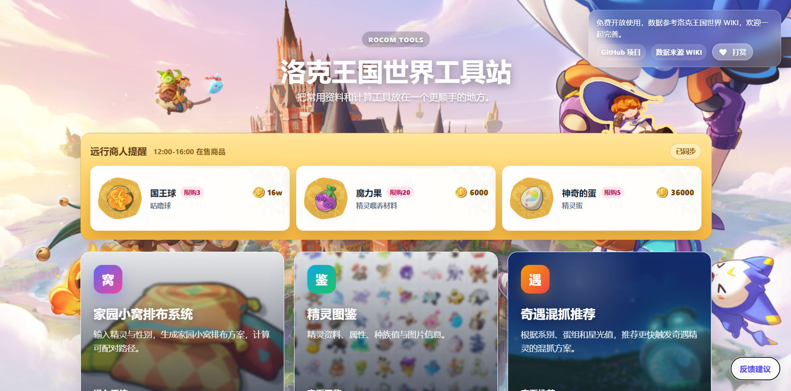

<div align="center">

# 洛克王国世界工具站

面向《洛克王国：世界》玩家的网页工具合集，当前包含家园小窝排布、精灵图鉴、奇遇混抓推荐、远行商人提醒与反馈入口。

[](./LICENSE)
[]()
[]()

[在线访问](http://wentao-home.cn) · [更新日志](./CHANGELOG.md)

</div>

---

## 重要截图待补充

> **【图片待补充：首页总览】**  
> 建议保存为 `./screenshots/home-overview.png`，用于展示主页、远行商人提醒和三个功能入口。



> **【图片待补充：家园小窝排布】**  
> 建议保存为 `./screenshots/hatch-layout.png`，用于展示输入区、最优排布图和配对明细。


> **【图片待补充：精灵图鉴详情】**  
> 建议保存为 `./screenshots/handbook-detail.png`，用于展示精灵详情、果实收益和进化链区域。


> **【图片待补充：奇遇混抓推荐】**  
> 建议保存为 `./screenshots/adventure-recommendation.png`，用于展示奇遇目标、候选家族、排序方式和推荐规则弹窗。


---

## 项目简介

这个项目最初是一个“家园孵蛋最优排布计算器”，现在已经扩展为一个轻量的洛克王国世界工具站。网站以静态页面为主，配合少量 PHP 接口处理远行商人数据抓取，适合部署在普通虚拟主机、宝塔面板、PHP 主机或任意支持静态文件访问的环境中。

当前主页会集中展示核心工具，并在标题下方显示远行商人当前售卖信息；各功能页面保持独立，便于玩家在手机端或电脑端快速查询。

---

## 功能总览

### 主页

- 展示工具站标题、数据来源、GitHub 入口和打赏入口。
- 标题下方提供“远行商人提醒”栏目，自动尝试同步当前售卖商品。
- 一屏进入三个核心模块：家园小窝排布、精灵图鉴、奇遇混抓推荐。
- 提供“反馈建议”快捷按钮，通过邮件客户端向 `tartykisser1022@gmail.com` 发送反馈。
- 适配桌面端与移动端，远行商人图片、商品卡片和功能入口会随屏幕宽度调整。

### 家园小窝排布系统

文件入口：[`hatch.html`](./hatch.html)

- 支持 2 至 10 个家园小窝的排布计算。
- 输入精灵名称时提供模糊联想，自动识别图鉴记录和蛋组。
- 支持设置精灵性别，并按生蛋规则校验可配对关系。
- 自动生成推荐排布图，展示每个小窝的位置、精灵头像和性别标识。
- 输出配对明细，方便直接照着游戏内摆放。
- 页面右侧提供“回到顶部”按钮，长页面操作更顺手。

### 精灵图鉴

文件入口：[`handbook.html`](./handbook.html)

- 支持按编号、名称、属性、蛋组、分布信息等维度检索精灵。
- 精灵详情展示基础信息、属性、蛋组、技能、特性、种族值等资料。
- 精灵果实收益区与进化链区并排展示：左侧为果实信息，右侧展示同一家族不同形态的图片和名称。
- 无进化链的精灵会明确显示“当前精灵无进化链”。
- 从列表进入详情后返回，会尽量恢复原先滚动位置，避免重新回到页面顶部。
- 页面右侧提供“回到顶部”按钮。

### 奇遇混抓推荐

文件入口：[`adventure.html`](./adventure.html)

- 按“家族”维度选择奇遇目标，避免同一进化链的不同形态重复干扰推荐。
- 可选输入两种想用来混抓的候选家族，输入名称或编号时支持模糊搜索和候选项提示。
- 推荐结果会展示当前组合的星光值之和，以及还可能触发的稀有异色家族。
- 提供两种排序方式：
  - `星光值优先`：优先推荐综合星光值更高的组合。
  - `少歪异色优先`：优先推荐额外触发目标更少的组合。
- “推荐规则说明”按钮会读取 [`adventure_rules.txt`](./adventure_rules.txt)，以弹窗形式展示面向玩家的规则说明。
- 对同一编号存在多条形态记录的情况，推荐计算只使用该编号的第一条记录。
- 页面右侧提供“回到顶部”按钮。

### 远行商人提醒

主页入口：[`index.html`](./index.html)

- 访问主页时自动尝试同步远行商人当前售卖信息。
- PHP 部署环境下优先通过 [`merchant_proxy.php`](./merchant_proxy.php) 请求来源页面，减少浏览器跨域限制导致的失败。
- 商品使用本地资源进行展示：
  - 总背景：`./web_images/商品背景框.png`
  - 图标底框：`./web_images/商品图标背景.png`
  - 商人立绘：`./web_images/商人.png`
  - 洛克贝图标：`./web_images/coin.png`
  - 商品图片目录：`./web_images/shop/`
- 新商品图片可以直接放入 `web_images/shop/`，文件名建议与商品名称保持一致，例如 `魔力果.png`。

---

## 推荐规则简述

奇遇混抓推荐的详细玩家版说明维护在 [`adventure_rules.txt`](./adventure_rules.txt)。当前核心逻辑如下：

- 奇遇目标按进化链合并为家族。
- 混抓候选也按家族显示，结果以家族代表形态的图片和名称展示。
- “还可能触发”使用独立的 [`rare.csv`](./rare.csv) 数据。
- 家族星光值会按形态数量加权：
  - 单形态：使用自身星光值。
  - 双形态：`小形态 * 3.5 + 大形态 * 1.5` 后除以 5。
  - 三形态：`小形态 * 2.5 + 中形态 * 1.5 + 大形态 * 1` 后除以 5。
- 两个混抓家族的加权星光值相加，作为推荐组合的星光值之和。

---

## 数据与资源

### 核心数据文件

- [`handbook_data.json`](./handbook_data.json)：精灵图鉴主数据，供图鉴和推荐模块使用。
- [`handbook.csv`](./handbook.csv)：精灵编号、名称、蛋组等基础维护数据。
- [`adventure.csv`](./adventure.csv)：奇遇精灵目标数据。
- [`rare.csv`](./rare.csv)：稀有异色目标数据，用于“还可能触发”判断。
- [`evolution_chains.json`](./evolution_chains.json)：进化链数据，已合并进 `handbook_data.json`。
- [`adventure_rules.txt`](./adventure_rules.txt)：奇遇混抓推荐规则说明文本。

### 图片资源

- `rocom_imgs_standard/`：精灵头像图片。
- `web_images/`：主页、模块入口、打赏、商人提醒等页面资源。
- `web_images/shop/`：远行商人商品图片。
- `web_images/types/`：属性图标。
- `web_images/values/`：星光值、洛克贝等数值类图标资源。

> **【图片资源待检查】**  
> 如果页面出现商品图标缺失，优先检查 `web_images/shop/商品名称.png` 是否存在，文件名是否与页面抓取到的商品名一致。

---

## 本地预览

如果只预览静态页面，可以在 `ROCOM_hatch_eggs` 目录下启动简单 HTTP 服务：

```bash
python3 -m http.server 8021
```

然后访问：

```text
http://127.0.0.1:8021/
```

如果要同时测试远行商人 PHP 代理，建议使用 PHP 内置服务器或真实 PHP 环境：

```bash
php -S 127.0.0.1:8021
```

> 不建议直接用 `file://` 打开 HTML 文件。图鉴、推荐规则、CSV/JSON 数据读取都依赖浏览器 `fetch`，直接打开本地文件时可能被浏览器安全策略拦截。

---

## 部署说明

1. 将 `ROCOM_hatch_eggs` 目录中的文件上传到站点根目录或子目录。
2. 确保服务器可以访问 `.html`、`.css`、`.js`、`.json`、`.csv`、`.txt`、`.png`、`.jpg` 等静态资源。
3. 如果要启用远行商人自动同步，需要部署环境支持 PHP，并保留 [`merchant_proxy.php`](./merchant_proxy.php)。
4. 如果商人栏目显示“数据抓取失败”，请优先检查：
   - PHP 是否启用；
   - 服务器是否允许向外部网站发起请求；
   - `merchant_proxy.php` 是否能被浏览器访问；
   - 来源站点结构是否发生变化。
5. 如果反馈按钮无法自动打开邮件客户端，请检查用户设备是否配置默认邮箱应用；页面本身不会保存反馈内容。

---

## 目录结构

```text
ROCOM_hatch_eggs/
├── index.html              # 网站主页
├── hatch.html              # 家园小窝排布系统
├── handbook.html           # 精灵图鉴
├── adventure.html          # 奇遇混抓推荐
├── merchant_proxy.php      # 远行商人数据代理
├── handbook_data.json      # 图鉴主数据
├── handbook.csv            # 基础精灵维护数据
├── adventure.csv           # 奇遇目标数据
├── rare.csv                # 稀有异色目标数据
├── evolution_chains.json   # 进化链数据
├── adventure_rules.txt     # 推荐规则说明
├── rocom_imgs_standard/    # 精灵头像资源
├── web_images/             # 页面与功能资源
└── screenshots/            # README / CHANGELOG 图片
```

---

## 维护建议

- 新增精灵时，优先维护 `handbook_data.json` 与对应头像资源。
- 调整奇遇目标时，更新 `adventure.csv`。
- 调整“还可能触发”范围时，更新 `rare.csv`。
- 调整推荐规则对外说明时，更新 `adventure_rules.txt`。
- 新增远行商人商品图片时，将图片放入 `web_images/shop/`，并尽量让文件名与商品名一致。
- 更新页面展示后，建议同步补充 `screenshots/` 中的 README 图片。

---

## 致谢与说明

- 部分图鉴、蛋组、精灵资料参考 [洛克王国世界 WIKI](https://wiki.biligame.com/rocom)，感谢 WIKI 维护者与玩家社区。
- 本项目以玩家工具和资料整理为目的，所有游戏相关名称与素材版权归原权利方所有。
- 项目基于 [MIT License](./LICENSE) 开源。

<div align="center">

如果这个工具站帮到了你，欢迎 Star、反馈问题或提出改进建议。

</div>
